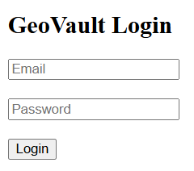
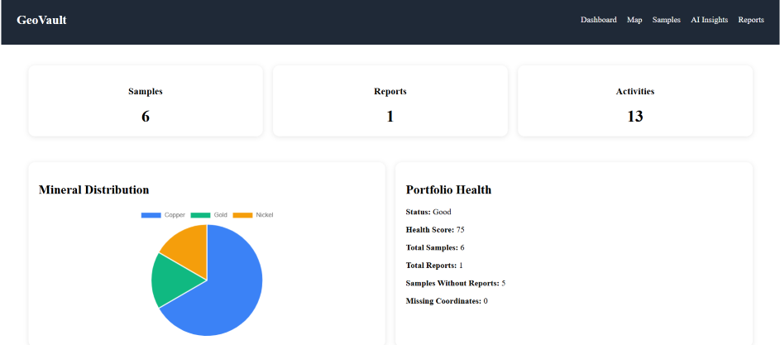
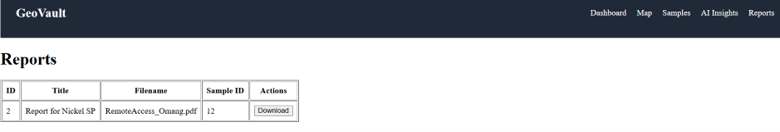
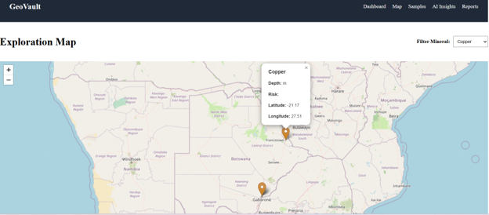
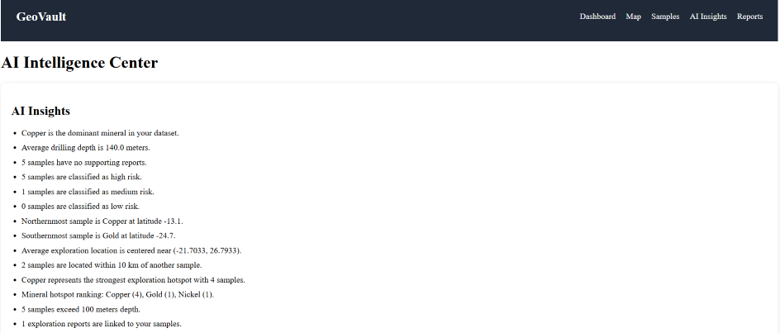

# GeoVault Full Stack Application

## Overview

GeoVault is a full-stack geological exploration management platform designed to help exploration teams manage geological samples, exploration reports, geospatial data, and AI-powered insights.

The application provides secure user authentication, sample management, document storage, map visualization, activity tracking, and intelligent exploration analysis through a modern web interface.

---

## Features

### Authentication & Security

* User registration
* User login
* JWT authentication
* Protected API endpoints
* User-specific data access

### Geological Sample Management

* Create geological samples
* View geological samples
* Update geological samples
* Delete geological samples
* Search samples by mineral and location
* Import samples from CSV files

### Exploration Report Management

* Upload exploration reports
* Associate reports with samples
* Download reports
* View reports by sample
* Track report ownership

### Mapping & Geospatial Analysis

* Interactive map visualization
* Sample location plotting
* Sample popup details
* Nearby sample search
* Geographic filtering
* GeoJSON support

### Activity Tracking

* User activity logging
* Audit trail
* Activity history dashboard

### AI-Powered Insights

* Sample summaries
* Risk assessments
* Opportunity scoring
* Exploration insights
* Executive briefings
* Portfolio health scoring
* High-priority target identification
* Exploration hotspot detection
* Narrative reporting

### Dashboard & Analytics

* Sample statistics
* Mineral distribution analysis
* Report statistics
* Activity summaries
* AI-generated recommendations

---

## System Architecture

Frontend (React + Vite)

↓

REST API (Flask)

↓

SQLAlchemy ORM

↓

PostgreSQL Database

↓

File Storage (Exploration Reports)

---

## Technology Stack

### Frontend

* React
* Vite
* Axios
* React Router
* Leaflet Maps

### Backend

* Python
* Flask
* Flask JWT Extended
* SQLAlchemy
* PostgreSQL

### DevOps & Tools

* Docker
* Git
* GitHub

---

## Project Structure

GeoVault-FullStack/

├── backend/

│ ├── models/

│ ├── routes/

│ ├── utils/

│ └── app.py

│

├── frontend/

│ ├── src/

│ ├── components/

│ ├── pages/

│ └── api/

│

└── README.md

---

## Screenshots

### Login Page

### Dashboard

### Samples Management and AI Summary Modal

### Reports Management

### Interactive Map

### AI Insights

## Demo Access

Use the following credentials to explore GeoVault:

Email: changu@gmail.com

Password: welcome

## Sample Data

A sample geological dataset is provided in:

sample-data/geological_samples.csv

Users can upload this CSV through the application to test:
- Sample imports
- Dashboard analytics
- AI summaries
- Mapping features
---

## Installation

### Clone Repository

git clone https://github.com/poppybatendi/GeoVault-FullStack.git

cd GeoVault-FullStack

### Backend Setup

cd backend

pip install -r requirements.txt

python app.py

### Frontend Setup

cd frontend

npm install

npm run dev

---

## API Highlights

### Authentication

POST /register

POST /login

### Samples

GET /samples

POST /samples

PUT /samples/<id>

DELETE /samples/<id>

### Reports

POST /reports/upload

GET /reports

GET /reports/<id>/download

### AI Services

POST /ai/sample-summary/<id>

GET /ai/risk-assessment/<id>

GET /ai/opportunity-score/<id>

GET /ai/insights

GET /ai/executive-briefing

GET /ai/portfolio-health

---

## Future Enhancements

* Advanced geological reporting
* PDF report generation
* Machine learning mineral prediction
* Role-based access control
* Cloud storage integration
* Mobile application
* Dark mode support
* Advanced map clustering
* Real-time collaboration

---

## Author

Poppy Batendi

Full Stack Developer

GitHub: https://github.com/poppybatendi
